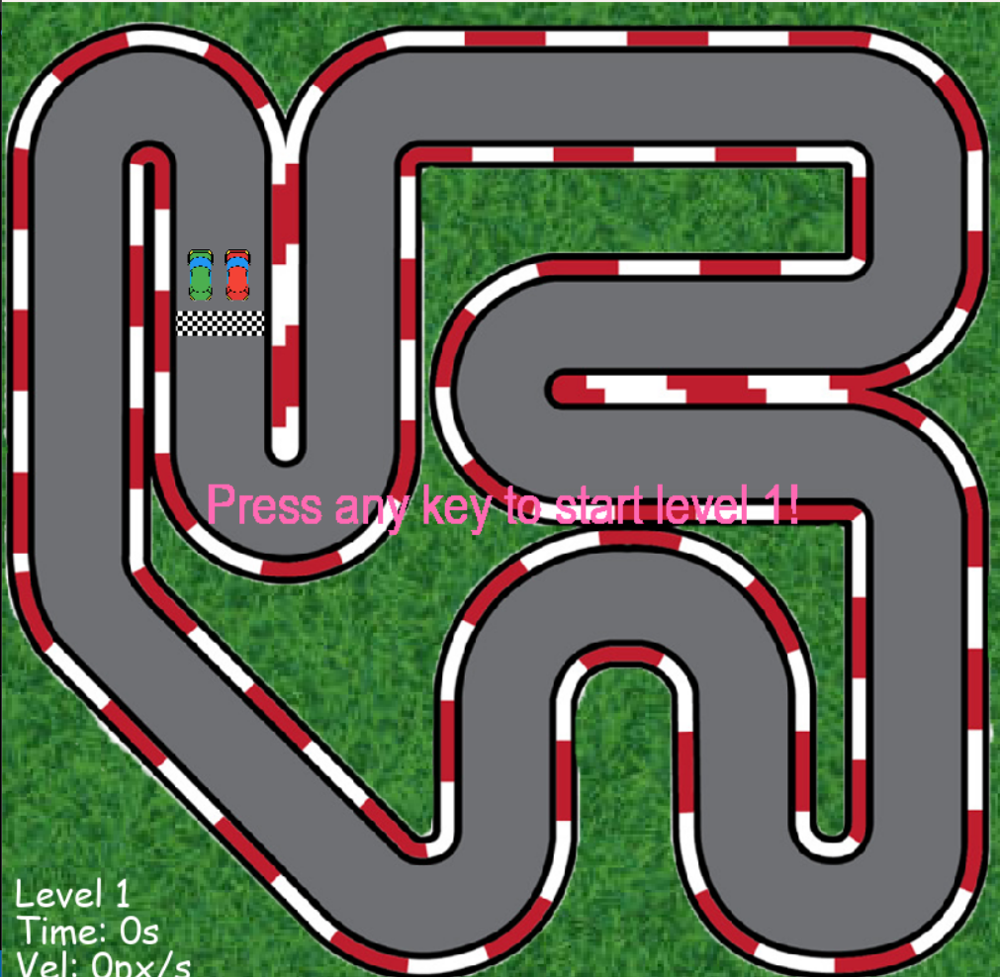
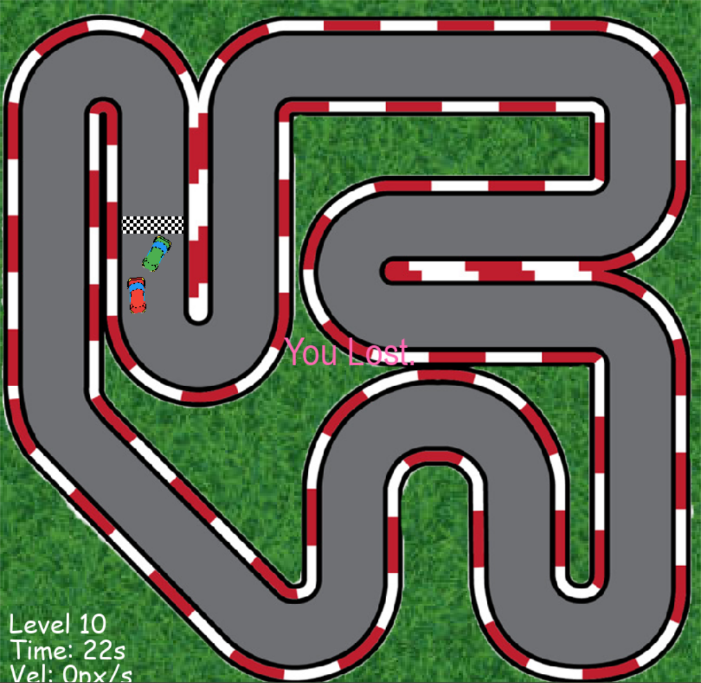

# Racing Game

A top-down racing game where you compete against an AI opponent on a challenging track. Beat the computer to the finish line across 10 progressively difficult levels!

## Screenshots



<br/>



## How to Play

- Control your red car using **WASD** keys
- Race against the green AI car following the track path
- Reach the finish line before the computer to advance to the next level
- Avoid driving off the track (track borders cause collision)
- Complete all 10 levels to win the game

## Controls

| Key | Action |
|-----|--------|
| W | Move forward / Accelerate |
| S | Move backward / Reverse |
| A | Rotate left |
| D | Rotate right |

## Game Features

- Smooth car physics with acceleration and momentum
- AI opponent with pathfinding along the track
- 10 progressively difficult levels (AI gets faster each level)
- Real-time speed display
- Track border collision detection
- Finish line with directional detection (cross from correct side)
- Level timer to track your performance

## Installation

1. Make sure you have Python installed (3.6+ recommended)

2. Install pygame:
```bash
pip install pygame
```

3. Make sure you have the `imgs` folder with all game images

4. Run the game:
```bash
python main.py
```

## Project Structure

```
├── main.py          # Game logic and loop
├── utils.py         # Helper functions (scaling, rotation, text)
├── imgs/            # Game images
│   ├── grass.jpg          # Background grass texture
│   ├── track.png          # Race track image
│   ├── track-border.png   # Track collision border
│   ├── finish.png         # Finish line image
│   ├── red-car.png        # Player car
│   └── green-car.png      # AI opponent car
└── screenshots/     # Gameplay screenshots
```

## Game Mechanics

### Track Path
The AI follows a predefined path of coordinates around the track:
- 22 waypoints guide the computer car
- The player can drive freely but must stay on track

### Collision System
- Pixel-perfect collision detection using masks
- Hitting track borders causes your car to bounce back
- The finish line only counts if crossed from the correct direction

### Level Progression
- Start at Level 1
- Each level increases AI speed by 0.2 units
- Complete level 10 to win the game
- Your car resets position after each level

### Display Information
- Current level number
- Lap/level time
- Current speed (pixels/second)

## AI Behavior

The computer car:
- Follows a predetermined path around the track
- Automatically calculates rotation angles toward the next waypoint
- Updates its target waypoint when reaching each point
- Increases speed with each level

## Asset Credits

Track design and car sprites from [Tech With Tim]

## License

[MIT](LICENSE)
